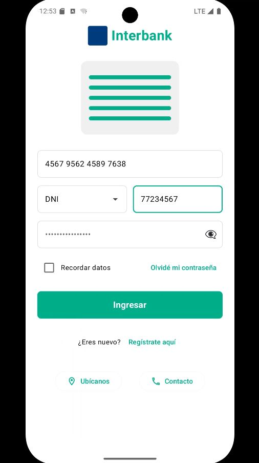
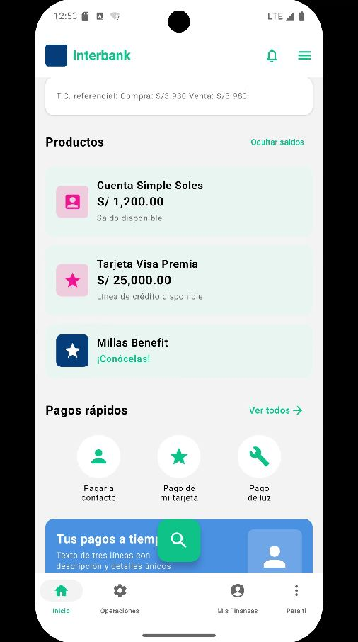

# Interbank - Aplicación Android

<p align="center">
  
  
</p>

[](https://kotlinlang.org)
[](https://developer.android.com/jetpack/compose)
[-brightgreen.svg)](https://developer.android.com/about/versions/16)
[](https://developer.android.com/about/versions)

## 📱 Descripción

Aplicación Android moderna desarrollada con las últimas tecnologías de desarrollo móvil de Google. Este proyecto implementa una interfaz de usuario bancaria con navegación fluida y componentes reutilizables utilizando Jetpack Compose.

## 🚀 Tecnologías Principales

- **Kotlin 2.0.21** - Lenguaje de programación moderno y conciso para desarrollo Android
- **Jetpack Compose** - Framework UI declarativo de última generación
- **Android 16 (API Level 36)** - Target SDK y Min SDK
- **Material Design 3** - Sistema de diseño de Google

## 🏗️ Arquitectura y Componentes

### Stack Tecnológico

#### UI y Navegación
- **Jetpack Compose BOM 2024.10.01** - Bill of Materials para Compose
- **Material3** - Componentes de Material Design 3
- **Navigation Compose 2.8.5** - Navegación entre pantallas
- **Activity Compose 1.9.3** - Integración con Activities

#### Funcionalidades
- **Core SplashScreen 1.0.1** - Pantalla de inicio moderna
- **Core KTX 1.17.0** - Extensiones de Kotlin para Android

#### Herramientas de Desarrollo
- **Android Gradle Plugin 8.13.1** - Sistema de compilación
- **Kotlin Gradle Plugin 2.0.21** - Soporte para Kotlin
- **Compose Compiler Plugin** - Compilador de Jetpack Compose

## 📂 Estructura del Proyecto

```
Interbank/
├── app/
│   ├── src/
│   │   ├── main/
│   │   │   ├── java/com/danieibazgc/interbank/
│   │   │   │   ├── MainActivity.kt
│   │   │   │   ├── navigation/
│   │   │   │   │   ├── NavigationGraph.kt
│   │   │   │   │   └── Screen.kt
│   │   │   │   ├── ui/
│   │   │   │   │   ├── components/
│   │   │   │   │   │   └── CommonComponents.kt
│   │   │   │   │   ├── screens/
│   │   │   │   │   │   ├── SplashScreen.kt
│   │   │   │   │   │   ├── LoginScreen.kt
│   │   │   │   │   │   └── HomeScreen.kt
│   │   │   │   │   └── theme/
│   │   │   │   │       ├── Color.kt
│   │   │   │   │       ├── Theme.kt
│   │   │   │   │       └── Type.kt
│   │   │   │   └── utils/
│   │   │   │       └── FormatUtils.kt
│   │   │   ├── res/
│   │   │   └── AndroidManifest.xml
│   │   ├── test/
│   │   └── androidTest/
│   ├── build.gradle.kts
│   └── proguard-rules.pro
├── gradle/
│   ├── libs.versions.toml
│   └── wrapper/
├── build.gradle.kts
├── settings.gradle.kts
└── README.md
```

## 🎨 Características

### Pantallas
- **Splash Screen** - Pantalla de bienvenida con animación
- **Login Screen** - Pantalla de autenticación
- **Home Screen** - Pantalla principal de la aplicación

### Componentes
- **Componentes Reutilizables** - Biblioteca de componentes comunes
- **Tema Personalizado** - Sistema de diseño coherente con Material3
- **Utilidades de Formato** - Funciones auxiliares para formateo de datos

### Navegación
- Sistema de navegación basado en rutas
- Gestión de estado de navegación con NavController
- Pantallas definidas como objetos sellados (Sealed Classes)

## 🛠️ Requisitos

- **Android Studio** Iguana | 2024.1.1 o superior
- **JDK** 11 o superior
- **Gradle** 8.0 o superior
- **Dispositivo/Emulador** con Android 16 (API 36) o superior

## 📦 Instalación

1. Clona el repositorio:
```bash
git clone https://github.com/tu-usuario/interbank.git
```

2. Abre el proyecto en Android Studio

3. Sincroniza las dependencias de Gradle:
   - Android Studio sincronizará automáticamente
   - O ejecuta: `./gradlew build`

4. Ejecuta la aplicación:
   - Conecta un dispositivo Android o inicia un emulador
   - Presiona el botón "Run" en Android Studio
   - O ejecuta: `./gradlew installDebug`

## 🔧 Configuración

### Configuración de Build

- **Application ID**: `com.danieibazgc.interbank`
- **Compile SDK**: 36
- **Min SDK**: 36
- **Target SDK**: 36
- **Version Code**: 1
- **Version Name**: 1.0

### Configuración de Java

- **Source Compatibility**: Java 11
- **Target Compatibility**: Java 11
- **JVM Target**: 11

## 📚 Dependencias Principales

```kotlin
// Core Android
implementation("androidx.core:core-ktx:1.17.0")
implementation("androidx.appcompat:appcompat:1.7.1")
implementation("com.google.android.material:material:1.13.0")
implementation("androidx.core:core-splashscreen:1.0.1")

// Jetpack Compose
implementation(platform("androidx.compose:compose-bom:2024.10.01"))
implementation("androidx.compose.ui:ui")
implementation("androidx.compose.ui:ui-graphics")
implementation("androidx.compose.ui:ui-tooling-preview")
implementation("androidx.compose.material3:material3")
implementation("androidx.activity:activity-compose:1.9.3")
implementation("androidx.navigation:navigation-compose:2.8.5")

// Testing
testImplementation("junit:junit:4.13.2")
androidTestImplementation("androidx.test.ext:junit:1.3.0")
androidTestImplementation("androidx.test.espresso:espresso-core:3.7.0")
```

## 🧪 Testing

### Tests Unitarios
```bash
./gradlew test
```

### Tests Instrumentados
```bash
./gradlew connectedAndroidTest
```

## 📱 Build

### Debug Build
```bash
./gradlew assembleDebug
```

### Release Build
```bash
./gradlew assembleRelease
```

## 🎯 Características de Jetpack Compose

Este proyecto aprovecha las ventajas de Jetpack Compose:

- **UI Declarativa** - Describe la UI en función del estado actual
- **Menos Código** - Menos código boilerplate comparado con Views tradicionales
- **Desarrollo Rápido** - Vista previa en tiempo real con `@Preview`
- **Interoperabilidad** - Funciona con código existente de Views
- **Material Design 3** - Componentes modernos y actualizados

## 🔐 ProGuard

El proyecto incluye reglas de ProGuard para optimización en builds de release. Las reglas personalizadas se encuentran en `app/proguard-rules.pro`.

## 📄 Licencia

Este proyecto es de uso educativo y demostrativo.

## 👤 Autor

**Daniel Ibañez**
- Package: `com.danieibazgc.interbank`

## 📞 Soporte

Para reportar problemas o sugerencias, por favor abre un issue en el repositorio del proyecto.

---

**Nota**: Esta aplicación requiere Android 16 (API Level 36) como mínimo. Asegúrate de tener configurado un emulador o dispositivo compatible para ejecutar la aplicación.

